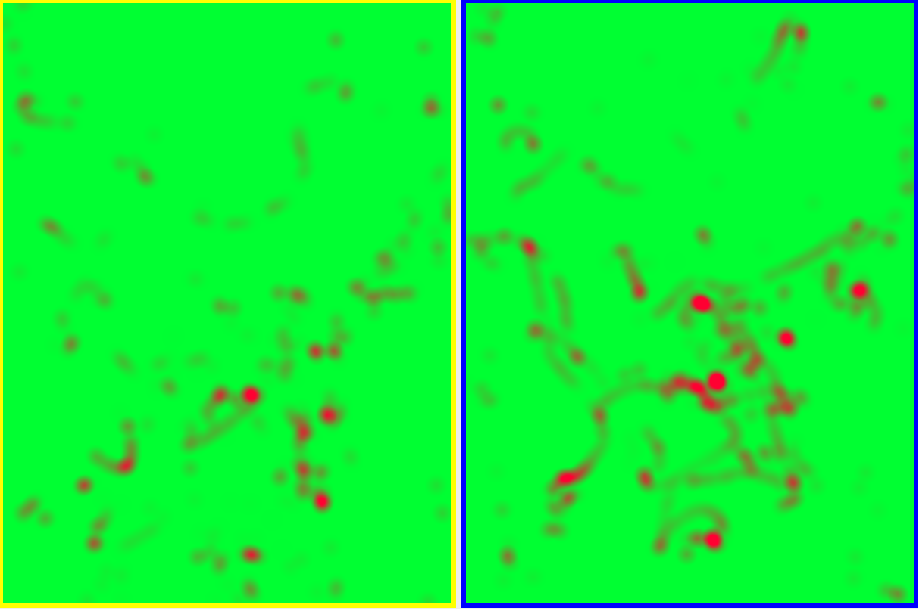

# JHeatmap

I searched a bit but did not find any beautiful Heatmap, so i decided to create one by myself.

## Description
This Heatmap represents a set of 2D-Points spread over a predefined field. For computational reasons you can set the resolution of the output image. The Heatmap projects the input (heat centers) to the image automatically.

A Input (consists of X and Y coordinates) represent a heat center. From this point heat is spreading linear over the field. The spreading radius is configurable and could be changed during runtime. If another heat center is near the heat values are simply added.

For representation there has to be a upper bound of the heat value in a point. This upper bound is also configurable. Therefore a new heat center adds 1 (at the center) to the heatmap and decrease in distance to the point.

At the moment only the background color is configurable. Heat is represented by red.

## Example
An example of the JHeatmap: 
Shown are ball possessions in a real RoboCup Small Size League Game.
 

